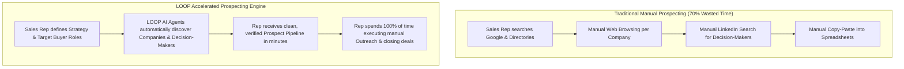
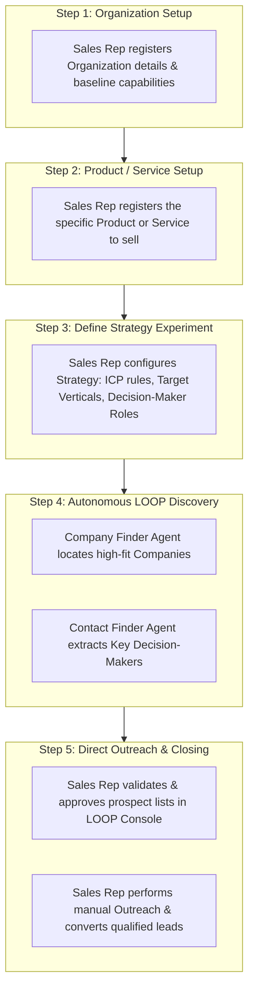
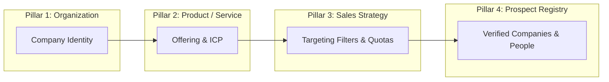
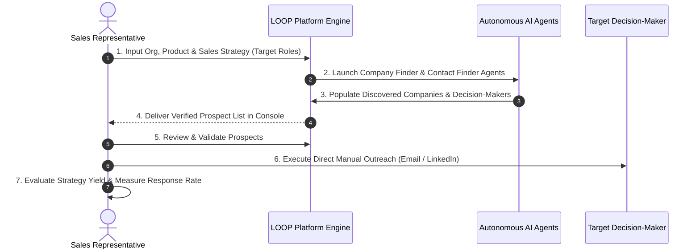

# PROJECT GUIDE: LOOP Platform

> **Single Source of Truth** for AI Agents, Developers, and System Designers  
> **Vision:** Autonomous B2B Prospecting & Lead Discovery Engine Built for Sales Teams  
> **Core Objective:** Eliminate wasted manual research hours by automating top-of-funnel company and decision-maker discovery while preserving 100% human control over outreach and deal closing.

---

## 1. Executive Briefing & Product Vision

**LOOP** is an **Autonomous B2B Prospecting & Lead Discovery Engine Built for Sales Teams**. Its single mission is to **eliminate hundreds of wasted manual research hours** spent hunting for potential customers, allowing sales representatives to find the right target companies and right decision-makers at maximum speed.

### The Sales Challenge vs. The LOOP Solution

- **The Sales Challenge:** Sales representatives spend up to **70% of their working hours on manual prospecting**—searching Google, navigating company websites, scrubbing directory lists, and hunting LinkedIn to identify matching companies and key buyers. This manual research wastes valuable sales hours that should be spent talking to clients.
- **The LOOP Solution:** LOOP automates the entire top-of-funnel research phase. Sales reps simply define their target strategy (ICP, target verticals, company size, buyer titles). LOOP's AI agents then browse the web and LinkedIn to automatically locate the exact target companies and right decision-makers to sell to. Once generated, sales reps receive a clean list of verified prospects to immediately begin outreach.

---

## 2. Executive Summary (Pitch to Stakeholders)

> **"LOOP gives sales reps back their most valuable asset: TIME.**  
> By replacing manual list scrubbing with autonomous AI discovery agents, sales teams define their targeting criteria once, let LOOP find the right companies and right people to sell to, and spend 100% of their day conducting outreach and closing revenue."

---

## 3. The 3-Step Setup & Discovery Workflow for Sales Teams

Sales representatives complete a fast, 3-step setup to launch an autonomous discovery effort:

### Deep-Dive: The Intentions & Dark Spots Covered by Each Setup Form

To eliminate research confusion and prevent field duplication, each of the three setup forms addresses a specific operational layer. Together, they eliminate critical prospecting blind spots to provide AI agents with a complete 360-degree picture:

#### 1. Organization Setup Form (*Seller Identity & Global Boundaries*)
- **Core Intention:** Answers **"Who is the seller?"** Defines baseline corporate identity, operational territories, delivery capacity, compliance frameworks (ISO, SOC 2, GDPR), macro deal breakers, and global operational boundaries.
- **Dark Spot Covered (*The Seller Misalignment Blind Spot*):** Prevents AI agents from wasting time discovering prospects in geographical regions or regulatory environments where the seller cannot legally or operationally deliver services.

#### 2. Product / Service Setup Form (*Offering Solution & Baseline ICP*)
- **Core Intention:** Answers **"What are we selling?"** Details the core value proposition, key problems solved, product differentiators, pricing models, default buyer personas, and baseline Ideal Customer Profile (ICP) criteria.
- **Dark Spot Covered (*The Value Proposition Blind Spot*):** Prevents AI agents from targeting companies that do not actually suffer from the problems the product solves, or pitching capabilities to irrelevant market segments.

#### 3. Sales Strategy Setup Form (*Active Campaign Run Configuration*)
- **Core Intention:** Answers **"What are we hunting right now?"** Configures active campaign run quotas (target company & contact counts), campaign-specific decision-maker roles & seniority levels, active buying signals, and run-level exclusion rules / blacklists.
- **Dark Spot Covered (*The Tactical Campaign Blind Spot*):** Prevents generic, uncalibrated research by enforcing exact execution boundaries, target quotas, active buying triggers, and campaign-specific role filters for this specific outreach run.

#### 💡 The Complete Picture (Synergy of All Three Forms)
No single form provides enough context for autonomous discovery on its own:
- **Organization Setup** sets non-negotiable macro boundaries.
- **Product Setup** grounds the offering solution and core buyer pain points.
- **Sales Strategy** activates targeted campaign parameters and quotas.

Combining all three eliminates all research blind spots, giving LOOP's autonomous AI agents (Planner, Company Finder, Contact Finder) the exact clarity required to discover high-fit target companies and decision-makers without field duplication or ambiguity.

---

## 4. Clear System Boundaries (What LOOP Does vs. Sales Rep Role)

To set clear expectations with stakeholders and keep development consistent, LOOP automates target discovery while leaving outreach control in the hands of the sales rep:

| Prospecting Phase | Handled By | How It Works |
| :--- | :---: | :--- |
| **Organization & Product Setup** | Sales Rep | Configures what the company offers and value propositions. |
| **Target Strategy Setup** | Sales Rep | Defines ICP criteria, target industries, and target decision-maker titles. |
| **Target Company Discovery** | **LOOP (AI Agent)** | Automates web searches to find companies matching the strategy. |
| **Decision-Maker Extraction** | **LOOP (AI Agent)** | Automates LinkedIn research to find the right people (CEOs, VPs, Directors). |
| **Lead Validation & Approval** | Sales Rep | Quickly approves valid prospects or blacklists unfit matches in LOOP console. |
| **Messaging & Outreach Execution** | Sales Rep | **Manual Outreach**: Sales rep contacts verified decision-makers directly. |
| **Strategy Yield Evaluation** | Sales Rep | Tracks which targeting strategy generated the highest response rate. |

---

## 5. Multi-Agent Engine Architecture

LOOP enforces context awareness across all autonomous agents using four distinct knowledge layers:

### Agent Roles & Responsibilities:

1. **Planner Agent**: Reads strategy parameters, sets up discovery tasks, structures operational execution plans, and monitors target quotas.
2. **Company Finder Agent**: Operates browser automation to locate and register high-fit target companies matching the strategy ICP.
3. **Contact Finder Agent**: Navigates company pages and LinkedIn to identify key decision-makers (CEOs, VPs, Directors).
4. **Operator Console**: Delivers clean, deduplicated prospect lists to the sales team with full auditability, approval controls, and direct manual outreach links.

---

## 6. End-to-End Execution Sequence

---

## 7. Key Business ROI for Stakeholders & Sales Leaders

- **⚡ 10x Prospecting Velocity**: Cuts research time from hours to minutes per campaign.
- **🚀 100% Focus on Outreach**: Sales reps stop scrubbing lists and spend all their time pitching and closing.
- **🎯 Higher Lead Quality**: Reaches the exact decision-makers matching specified ICP rules.
- **🛡️ Complete Rep Control**: Reps maintain full authority to validate leads and manage all outreach messaging.
- **🧹 Deduplicated Enterprise Hygiene**: Centralized registry prevents two sales reps from contacting the same decision-maker.

---

## 8. Alignment Principles for AI Agents & Developers

All AI agents, prompt designs, backend schemas, and UI components created or modified in this repository **must** strictly adhere to the following principles:

1. **Strict Discovery Focus:** LOOP is an autonomous B2B lead discovery engine. Outreach execution (sending emails, automated messaging, cadence management) is intentionally out of scope for the autonomous agent and remains 100% human-controlled by the sales rep.
2. **Form Tier Boundary Integrity:** Never mix Organization, Product, or Sales Strategy fields. Maintain clear separation between default product ICP characteristics and active strategy campaign run configurations.
3. **Agent Scope Protection:** Agents (Planner, Company Finder, Contact Finder) must operate exclusively within their defined discovery parameters and registries.
4. **Data Hygiene & Deduplication:** All discovered target companies and prospects must be centrally registered and deduplicated across active sales strategies.
