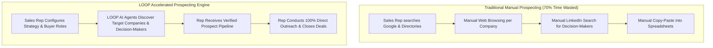
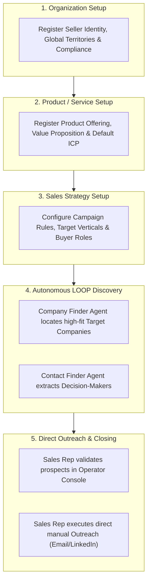
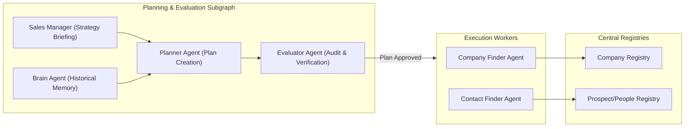

# LOOP: Autonomous B2B Prospecting & Lead Discovery Engine

> **Eliminate 70% of manual research hours** by automating top-of-funnel company and decision-maker discovery while keeping **100% human control over sales outreach**.

---

## 🚀 Overview & Vision

**LOOP** is an autonomous B2B prospecting engine built for modern B2B sales teams. Sales representatives spend up to **70% of their working hours on manual prospecting**—searching Google, inspecting company websites, scrubbing directory lists, and hunting LinkedIn for decision-maker titles.

LOOP automates top-of-funnel research using an intelligent multi-agent AI architecture:
- Sales reps define their target strategy once (Ideal Customer Profile, target headcount, target verticals, buyer roles).
- Autonomous AI agents navigate web resources and directories to find matching target companies and exact decision-makers (CEOs, VPs, Directors).
- Sales reps receive a clean, deduplicated, verified prospect pipeline in the LOOP Console to conduct direct manual outreach and close deals.



---

## ⚡ The 3-Step Setup & Discovery Workflow

To eliminate research blind spots, LOOP structures setup into three distinct operational layers:



---

## 🛡️ Operational Boundaries (LOOP vs. Sales Rep)

LOOP strictly automates prospect discovery while reserving all outreach control for the human sales rep:

| Prospecting Phase | Handled By | Description |
| :--- | :---: | :--- |
| **Organization & Product Setup** | Sales Rep | Defines seller capabilities, value props, and baseline ICP. |
| **Sales Strategy Configuration** | Sales Rep | Configures target verticals, headcount boundaries, and target buyer titles. |
| **Target Company Discovery** | **LOOP (AI Agent)** | Automates web research to locate companies matching ICP. |
| **Decision-Maker Extraction** | **LOOP (AI Agent)** | Automates web/LinkedIn research to extract key decision-makers. |
| **Lead Validation & Approval** | Sales Rep | Reviews, approves, or blacklists candidates in the LOOP Console. |
| **Messaging & Sales Outreach** | Sales Rep | **100% Human Outreach**: Direct email/LinkedIn outreach by the rep. |

---

## 🏗️ Multi-Agent Architecture

LOOP uses a hierarchical LangGraph multi-agent graph with mode-enforced middleware permissions:



### Core Agents & Subagents:
- **Planner Agent**: Audits baseline plan state, queries strategy & memory context, constructs deterministic hierarchical execution plans.
- **Evaluator Agent**: Audits generated plans against strict operational boundaries, self-containment, tool existence, and ICP alignment.
- **Sales Manager Subagent**: Sole authority for seller strategy, product context, value propositions, and exclusion rules.
- **Brain Agent**: Long-term memory query & persistence engine for campaign experiences and failure risks.
- **Company Finder Agent**: Browser automation worker that discovers and authoritatively registers matching target companies.
- **Contact Finder Agent**: Browser automation worker that identifies decision-makers for verified target companies.

---

## 💻 Tech Stack

### Backend
- **Framework**: Python 3.12, FastAPI, Uvicorn
- **Agent Orchestration**: LangGraph, LangChain Core, LangGraph Checkpoint
- **Database & ORM**: SQLAlchemy 2.0 (AsyncIO), Alembic, SQLite (`aiosqlite`) / PostgreSQL (`psycopg3`)
- **Logging & Monitoring**: `structlog`, OpenTelemetry, Prometheus Client
- **Testing**: Pytest, Pytest-AsyncIO

### Frontend
- **Framework**: React 19, Vite, TypeScript
- **Styling**: TailwindCSS v4, Radix UI primitives, Lucide Icons
- **State & Data Handling**: Axios, Zustand, React Hook Form, Zod
- **Testing & Tooling**: Vitest, Playwright (E2E), Oxlint, `openapi-typescript`

---

## 📦 Project Structure

```text
.
├── backend/                  # FastAPI & LangGraph Agent Engine
│   ├── src/
│   │   ├── agents/           # Planner, Evaluator, Company/Contact Finder Graphs & Tools
│   │   │   └── prompt_files/ # Agent System Prompts & Markdown Instructions
│   │   ├── api/              # FastAPI Routers & Endpoints
│   │   ├── application/      # Domain Services & Business Logic
│   │   ├── domain/           # Pydantic Schemas & Domain Models
│   │   └── persistence/      # Database Models, Repositories & Migrations
│   ├── tests/                # Pytest Test Suite
│   ├── requirements.txt      # Python Dependencies
│   └── start_server.sh       # FastAPI Server Startup Script
├── frontend/                 # React + Vite Frontend Application
│   ├── src/
│   │   ├── features/         # Setup Chat, Sales Strategies, Products, Leads UI
│   │   ├── shared/           # API Clients, Generated Types, UI Components
│   │   └── main.tsx          # Application Entry Point
│   ├── package.json          # Node Dependencies & NPM Scripts
│   └── vite.config.ts        # Vite Configuration
├── openapi.json              # OpenAPI Schema Specification
├── PROJECT_GUIDE.md          # Architectural & Business Specification
└── README.md                 # Project Overview & Setup Instructions
```

---

## ⚙️ Local Setup & Running Instructions

### 1. Prerequisites
- **Python**: `3.12+`
- **Node.js**: `v20+` & `npm`
- **Virtual Environment Tool**: `uv` or standard Python `venv`

---

### 2. Backend Setup

1. **Navigate to backend directory**:
   ```bash
   cd backend
   ```

2. **Create & activate Python virtual environment**:
   ```bash
   python3 -m venv venv
   source venv/bin/activate
   ```

3. **Install dependencies**:
   ```bash
   pip install -r requirements.txt
   ```

4. **Configure environment variables**:
   ```bash
   cp .env.example .env
   ```
   *Edit `.env` to configure your OpenAI / LLM API keys.*

5. **Run database migrations**:
   ```bash
   alembic upgrade head
   ```

6. **Start FastAPI development server**:
   ```bash
   ./start_server.sh
   # OR
   PYTHONPATH=src uvicorn api.main:app --reload --port 8000
   ```
   *Server will be available at `http://localhost:8000`. Interactive API documentation is accessible at `http://localhost:8000/docs`.*

---

### 3. Frontend Setup

1. **Navigate to frontend directory**:
   ```bash
   cd frontend
   ```

2. **Install Node dependencies**:
   ```bash
   npm install
   ```

3. **Generate TypeScript API client schema (Optional)**:
   ```bash
   npm run generate:types
   ```

4. **Start Vite development server**:
   ```bash
   npm run dev
   ```
   *Frontend application will be accessible at `http://localhost:5173`.*

---

## 🧪 Running Tests

### Backend Unit & Agent Integration Tests
```bash
cd backend
PYTHONPATH=src python3 -m pytest tests/
```

### Frontend Unit & E2E Tests
```bash
cd frontend
# Unit tests
npm run test

# End-to-End Playwright tests
npm run test:e2e
```

---

## 📄 License & Guidelines

This repository is maintained for autonomous B2B client discovery. All contributors and AI agent developers must adhere to the principles outlined in [PROJECT_GUIDE.md](./PROJECT_GUIDE.md).
