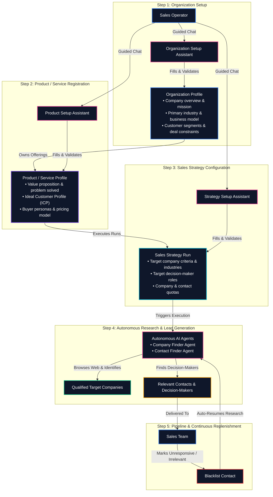

# LOOP Product Ontology & Operational Flow

**Product Name:** LOOP  
**Kind:** AI-Powered Sales Lead Generation Service  

---

## 1. Executive Summary

LOOP is an AI-powered sales lead generation service that automates B2B prospect discovery. Instead of sales teams spending hours manually researching target companies and decision-makers, sales operators define their organization, register their product offerings, and set up targeted prospecting strategies. LOOP's autonomous AI agents then conduct the research on the web, registering qualified companies and finding relevant decision-makers to maintain a continuous sales pipeline.

---

## 2. Platform Setup & Domain Hierarchy Flow

The onboarding and strategy setup follows a structured, guided sequence. At each stage, dedicated AI Setup Assistants guide the human sales operator through natural conversation to fill and validate profile forms step-by-step:

---
