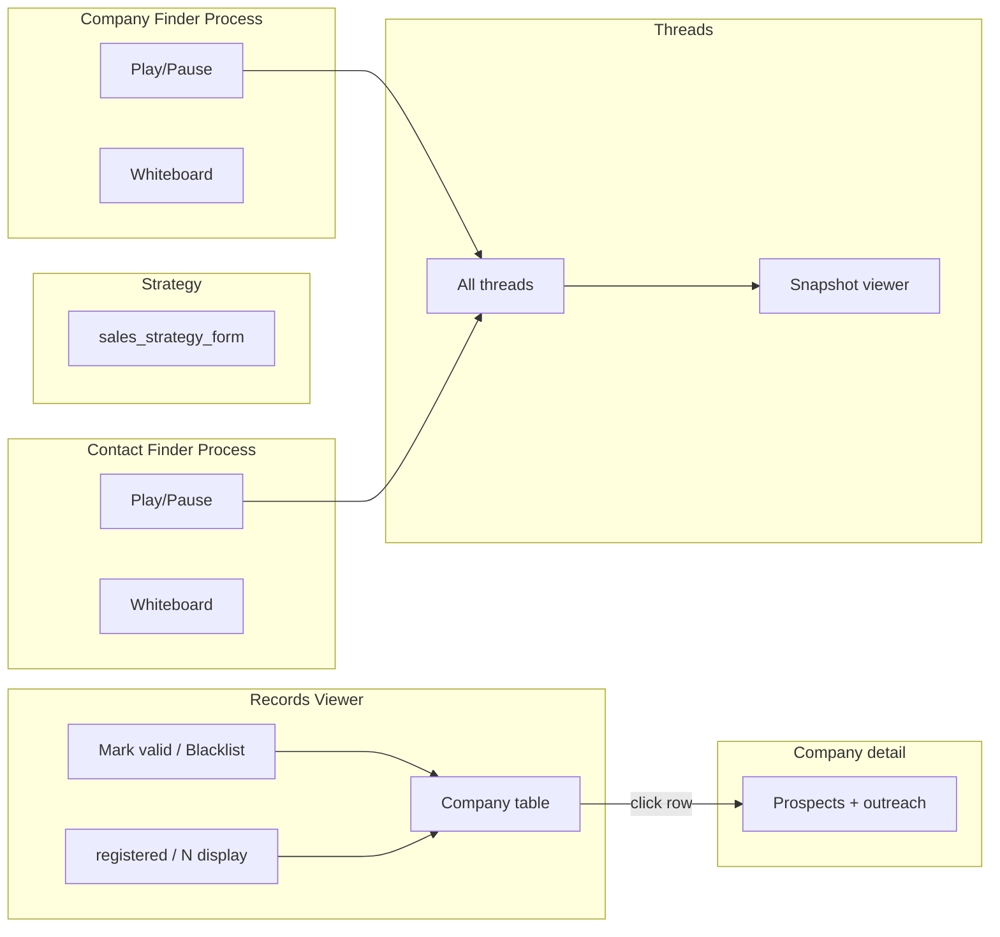

# Database and Persistence Plan

## Objectives and scope

Build PostgreSQL persistence for transactional domain data, the transactional outbox, audit records, agent runs, LangGraph checkpoints, vector-backed memory, and read projections. Define migration, backup, retention, and repository standards.

## Functional requirements

- Persist Organization, Product/Profile, SalesStrategy, global Company/Profile and ProspectProfile registries, strategy junctions, validation/outreach records, blacklists, events, process state, and AgentRun.
- Enforce natural-key deduplication and foreign-key integrity.
- Atomically commit business writes, audit entries, and outbox events.
- Isolate LangGraph checkpoint/store tables in `agent_brain`.
- Support sales strategy thread lookup and contact/company queue queries.
- Provide point-in-time recovery and tested restore procedures.

## Non-functional requirements

- PostgreSQL 16+ in every environment; no SQLite compatibility layer.
- Zero acknowledged transactional writes lost.
- RPO 15 minutes; RTO 60 minutes for OLTP.
- Backward-compatible migrations and bounded query latency.
- PII and large artifacts have explicit retention policies.

## Architecture and design decisions

- SQLAlchemy 2 async repositories and Unit of Work.
- Alembic expand/migrate/contract workflow; no destructive migration in a normal deploy.
- Strong consistency inside an aggregate; projections are eventually consistent.
- `agent_brain` shares an instance initially but remains schema-isolated.
- Browser snapshots belong in object storage; only references/metadata belong in OLTP.
- Monthly partitioning is until volume proves it necessary.

## Data models

Core relationships:

```text
Organization 1─1 OrganizationProfile
Organization 1─* Product 1─1 ProductProfile
Product 1─* SalesStrategy

Company 1─0..1 CompanyProfile
Company 1─* CompanyProspect *─1 ProspectProfile

SalesStrategy 1─* SalesStrategyCompany *─1 Company
SalesStrategy 1─* SalesStrategyProspect *─1 ProspectProfile
SalesStrategyProspect *─1 Company
SalesStrategyProspect 1─* ProspectEvent / OutreachEvent

SalesStrategy 1─* AgentRun
```

Key invariants:

- Product requires `organization_id`.
- Sales strategy belongs to exactly one product and is immutable after submit.
- `Company.domain` (registrable domain, e.g. `acme.com`) is globally unique; normalize from input URL at registration (`packages/validation/domain`).
- `CompanyProfile` is optional 1:1 and reserved for the optional Company Detail Enricher.
- `ProspectProfile.linkedin_url` is canonical LinkedIn `/in/` profile URL (see `packages/validation/linkedin_profile_url`).
- `CompanyProspect`: one active company per `ProspectProfile` (replace on employer change).
- `SalesStrategyCompany` unique on `(sales_strategy_id, company_id)` — selection, funnel, quota, queue, and strategy-scoped blacklist (`is_blacklisted` default `false`, `blacklist_reason` required when `true`, optional `blacklisted_at` / `blacklisted_by`).
- `SalesStrategyProspect` unique on `(sales_strategy_id, company_id, prospect_profile_id)` — selection, outreach, validate gate, and strategy-scoped blacklist (same column pattern).
- `contacts_target` fixed at mark-valid; `contacts_registered` counts `SalesStrategyProspect` rows where `is_blacklisted = false`.
- `companies_registered` counts `SalesStrategyCompany` rows where `is_blacklisted = false` toward `target_companies`.
- `sales_strategy_attempt_at_register` frozen when `SalesStrategyCompany` is first created.

Storage areas:

- `public`: OLTP entities, `integration_event`, `audit_event`, process state.
- `agent_brain`: checkpoints, checkpoint blobs, LangGraph store/vector data.
- Object storage: browser evidence, exports, large snapshots.

## APIs and interfaces

- `DatabaseSessionFactory`
- `UnitOfWork`
- Context repositories (`SalesStrategyRepository`, `CompanyRepository`, etc.).
- `OutboxRepository.append(event)` inside business transaction.
- `CheckpointRepository.list_by_effort_prefix(prefix)`.
- Read repositories for Records Viewer, Threads, progress, and process status.

## Target directory structure

```text
loop/packages/database/
├── engine.py
├── session.py
├── unit_of_work.py
├── models/
├── repositories/
├── migrations/
│   ├── versions/
│   └── env.py
├── outbox/
├── projections/
└── backup/
```

## Milestones and implementation tasks

### M1 — Persistence foundation

- Configure async engine, pooling, transaction scopes, and test database.
- Implement migration runner and schema conventions.
- Add OrganizationProfile, Product/Profile, and SalesStrategy migrations.

### M2 — Global registry, strategy links, and outreach schema

- Add global `Company`, optional `CompanyProfile`, global `ProspectProfile`, and `CompanyProspect`.
- Add `SalesStrategyCompany` and `SalesStrategyProspect` with strategy-specific selection, funnel, quota, `is_blacklisted` / `blacklist_reason`, audit, and outreach fields.
- Add global domain/LinkedIn normalization constraints, junction uniqueness, validation, and outreach history.
- Add audit records and timestamps.

### M3 — Agents and events

- Add `integration_event`, `agent_run`, process state, whiteboard/scratchpad metadata.
- Install/create `agent_brain` checkpoint/store schema.
- Add thread-prefix and queue indexes.

### M4 — Operations

- Add backup schedules, PITR, restore scripts, retention jobs, and size monitoring.
- Establish query-plan review and migration rollout checklist.
- Add projection reconciliation tools.

## Dependencies

- Foundation configuration/logging.
- Domain definitions from Backend plan.
- Infrastructure-provided PostgreSQL, object storage, and backup target.
- Enables Backend, API, agents, events/workers, and analytics.

## Testing strategy

- Testcontainers PostgreSQL for repository and migration tests.
- Upgrade from empty DB and previous release snapshot.
- Constraint tests for every invariant and dedup key.
- Concurrent registration and quota race tests.
- Outbox atomicity and replay/idempotency tests.
- Backup restore drill with checksum/data-count verification.
- Query-plan tests for sales strategy list, queue, thread, and progress paths.

## Risks and open questions

- Final LangGraph checkpoint schema/version must be pinned and migration-tested.
- Whiteboard storage may evolve from scratchpad rows to section records.
- Decide whether progress projections are tables or materialized views initially.
- Normalize domains/profile URLs in application value objects and persist canonical forms.
- Clarify retention duration for LinkedIn profile data and evidence.

## Acceptance criteria

- All core entities migrate cleanly on production-like PostgreSQL.
- Duplicate global company/prospect registration and duplicate strategy links are safe under concurrency.
- Business write + audit + outbox commit atomically.
- Required Records Viewer, queue, and Threads queries meet API latency targets.
- Restore drill meets RPO/RTO objectives.
- No large browser snapshot payload is stored directly in OLTP.

## Operator workflow (company → contact)

The sales strategy **workspace** ([frontend plan](05-frontend.md)) is the single entry point after selecting a sales strategy. Company discovery and contact discovery are **separate background processes** with independent start/stop on their **Process** tabs. Operator actions on companies and contacts live on **Records Viewer** and **Company detail**.

#### Sales Strategy workspace tabs

| Tab | Route | Operator actions |
|-----|-------|------------------|
| **Strategy** (default) | `/sales-strategies/:id/strategy` | View sales strategy form (immutable after create) |
| **Records Viewer** | `/sales-strategies/:id/records` | Company table; **Mark valid** / **Blacklist**; click → company detail |
| **Company Finder Process** | `/sales-strategies/:id/company-finder` | Start/stop Company Finder; stats/logs; whiteboard |
| **Contact Finder Process** | `/sales-strategies/:id/contact-finder` | Start/stop Contact Finder; stats/logs; whiteboard |
| **Threads** | `/sales-strategies/:id/threads` | All threads (linked + unlinked) → snapshot viewer |

**Drill-down:** `/sales-strategies/:id/companies/:companyId` — full company data, prospects list, outreach fields, fixed quota display.



#### Company funnel (`SalesStrategyCompany.funnel_stage`)

Blacklist is **not** a funnel stage — it is an orthogonal flag on the junction row (`is_blacklisted`, default `false`).

| Stage | Meaning | Contact Finder |
|-------|---------|----------------|
| `registered` | Company Finder registered company; awaiting operator review | Not eligible |
| `company_validated` | Operator marked valid; eligible for Contact Finder queue | Eligible when `is_blacklisted = false` and `contacts_registered < contacts_target` |
| `finding_contacts` | Contact Finder actively working this company | In progress |
| `contacts_batch_done` | `contacts_registered >= contacts_target` for fixed N | Paused until operator blacklists a prospect to free a slot (Contact Finder finds a replacement) |

**Mark valid:** sets `funnel_stage = company_validated`, `contacts_target = sales_strategy.contacts_per_company_default`, `prospect_queue_status = queued`, `validated_at = now()`.

#### Strategy-scoped blacklist (junction columns)

Blacklist state lives on **`SalesStrategyCompany`** and **`SalesStrategyProspect`** — no separate blacklist tables.

| Column | `SalesStrategyCompany` | `SalesStrategyProspect` |
|--------|------------------------|-------------------------|
| `is_blacklisted` | `boolean NOT NULL DEFAULT false` | `boolean NOT NULL DEFAULT false` |
| `blacklist_reason` | Required when `is_blacklisted = true`; cleared on unblacklist | Same |
| `blacklisted_at` | Set when blacklisted | Set when blacklisted |
| `blacklisted_by` | `operator` \| `agent` | `operator` \| `agent` |

**Blacklist company:** set `is_blacklisted = true` + `blacklist_reason`; company excluded from `companies_registered` and Contact Finder queue. Append **audit event** (history preserved in audit log).

**Unblacklist company:** set `is_blacklisted = false`, clear `blacklist_reason`; append audit event.

**Blacklist prospect:** set `is_blacklisted = true` + `blacklist_reason` on `SalesStrategyProspect`; excluded from `contacts_registered`; Contact Finder may register a replacement toward N.

**Agent `blacklist_prospect` (Contact Finder):** agent passes **minimal** input (`linkedin_url`, `blacklist_reason`; optional sparse name/title). Runtime supplies `sales_strategy_id` + `company_id` from the active effort. If no `SalesStrategyProspect` exists for that triple: get-or-create sparse `ProspectProfile` + `CompanyProspect`, create `SalesStrategyProspect` with `is_blacklisted = true` in one transaction. If already linked: set `is_blacklisted = true` only. Does **not** count toward `contacts_registered` or successful contact quota fill.

**Unblacklist prospect:** set `is_blacklisted = false`, clear `blacklist_reason`; append audit event.

#### Prospect outreach fields (`SalesStrategyProspect`, human only)

| Field | Values / rule |
|-------|----------------|
| `connection_request_status` | `sent` \| `ignored` \| `accepted` |
| `received_response` | yes / no |
| `response_sentiment` | `positive` \| `negative` (when received_response = yes) |
| `response_negative_reason` | Free text (required when sentiment = negative) |

#### Prospect queue status (`SalesStrategyCompany.prospect_queue_status`)

Shown on **Records Viewer** for validated companies:

| Status | Display | Condition |
|--------|---------|-----------|
| `queued` | In queue | Validated, waiting for Contact Finder |
| `in_progress` | In progress | Agent holds lock on this `company_id` |
| `batch_done` | Processed | `contacts_registered >= contacts_target` |

#### Per-company prospect quota (N)

| Field | Scope | Rule |
|-------|-------|------|
| `SalesStrategy.contacts_per_company_default` | SalesStrategy | Initial N when company validated (from strategy form §20) |
| `SalesStrategyCompany.contacts_target` | Strategy-company link | Current N — fixed at mark-valid |
| `SalesStrategyCompany.contacts_registered` | Strategy-company link | Count of `SalesStrategyProspect` rows where `is_blacklisted = false` toward N |

**Operator controls (Records Viewer + Company detail):**

| Action | API | Effect |
|--------|-----|--------|
| **Mark valid** | `POST .../companies/{companyId}/validate` | Sets `contacts_target` from `contacts_per_company_default` (fixed) |
| **Blacklist company** | `POST .../companies/{companyId}/blacklist` | Sets `is_blacklisted = true` + `blacklist_reason`; frees slot toward `target_companies` |
| **Unblacklist company** | `POST .../companies/{companyId}/unblacklist` | Sets `is_blacklisted = false`, clears `blacklist_reason` |
| **Blacklist prospect** | `POST .../prospects/{id}/blacklist` | Sets `is_blacklisted = true` + `blacklist_reason`; frees slot toward N |
| **Unblacklist prospect** | `POST .../prospects/{id}/unblacklist` | Sets `is_blacklisted = false`, clears `blacklist_reason` |

To pursue more contacts per company than the fixed N, create a **new sales strategy**.

Contact Finder picks the next company where `contacts_registered < contacts_target`, `SalesStrategyCompany.is_blacklisted = false`, `funnel_stage IN (company_validated, finding_contacts, contacts_batch_done)`, and `prospect_queue_status IN (queued, in_progress)` ordered by `validated_at`. **Gate:** do not start Contact Finder if `contacts_per_company_default <= 0`.

#### Whiteboard (process pages)

| Process | UI location | Scope |
|---------|-------------|-------|
| Company Finder | Company Finder Process → Whiteboard sub-tab | One whiteboard per process — sales-strategy-level active effort |
| Contact Finder | Contact Finder Process → Whiteboard sub-tab | One whiteboard per process — reflects current company in queue |

Backed by scratchpad store (`sales_strategy_id` + active `effort_prefix`); stored as markdown sections editable by agent and operator.

#### Sales strategy completion vs ongoing contact work

| Milestone | Rule |
|-----------|------|
| **Company phase complete** | `companies_registered` (non-blacklisted strategy-company links) `>= target_companies` → Company Finder stops (409 on further register) |
| **Contact phase** | Continues on validated companies until operator stops Contact Finder or all companies reach `contacts_batch_done` with no open quota |

## Agent effort threads (persistence summary)

Thread naming, linking rules, and snapshot viewer UX are specified in [§9.12](agent/AgentWithBrowser/03-checkpoints-and-threads.md#912-agent-effort-threads-and-snapshot-viewer). Database fields:

| Table | Fields |
|-------|--------|
| `sales_strategy` | `company_finder_attempt` — successful company registrations; `company_finder_effort_seq` optional monotonic for all effort starts |
| `sales_strategy_company` | `discovery_thread_id`, `sales_strategy_attempt_at_register`, `contact_finder_attempt`, funnel/quota fields, `is_blacklisted`, `blacklist_reason`, `blacklisted_at`, `blacklisted_by` |
| `sales_strategy_prospect` | `discovery_thread_id`, `outreach_validated_at`, outreach fields (`connection_request_status`, `received_response`, `response_sentiment`, `response_negative_reason`), `is_blacklisted`, `blacklist_reason`, `blacklisted_at`, `blacklisted_by` |
| `agent_run` | `effort_prefix`, `primary_thread_id`, `attempt_iteration`, `contact_attempt_iteration`, nullable `company_id` / `sales_strategy_prospect_id` until linked |

**Threads** tab lists all efforts; company detail may deep-link to a linked `discovery_thread_id` → `/sales-strategies/{id}/threads/snapshots?thread_id=...`.
