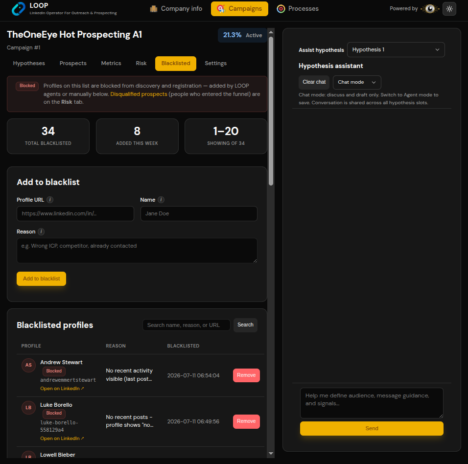

# UI Theme and Design System Plan

## Objectives and scope

Define the approved **LOOP operator UI theme** for greenfield development. This document is the visual source of truth for the React application and embedded snapshot/whiteboard panels.

The theme is a dark-first operator console with golden-amber primary actions, high-contrast data tables, summary metric tiles, and a persistent whiteboard side panel.

## Functional requirements

- Ship a token-based design system usable across all operator screens.
- **Default theme:** dark mode.
- Provide a theme toggle (light/dark) in the global navigation bar.
- Reuse the same primitives for:
  - Product/profile and sales strategy forms
  - Sales Strategy workspace tabs (Strategy, Records Viewer, process pages, Threads)
  - Company detail and outreach tables
  - Process control + whiteboard sub-tabs
  - Snapshot/thread inspection views
- Map POC patterns to production naming (no hypothesis-slot UI).

## Non-functional requirements

- WCAG 2.1 AA contrast for text, controls, and status badges in dark mode.
- Tokens defined once (CSS variables + Tailwind theme extension); no hard-coded hex in feature code.
- Components built on **Radix UI** primitives + **Tailwind CSS**.
- Responsive from 1280px desktop primary; tablet collapse rules documented.
- Visual regression baseline for core screens before feature freeze.

## Architecture and design decisions

- Internal design system lives in `apps/web/src/shared/components/` and `apps/web/src/shared/styles/`.
- Semantic tokens (`--color-bg-primary`, `--color-accent-primary`) map to palette values; components consume semantics only.
- Layout shell: global top nav + page header + horizontal tabs + main content (~70%) + optional right whiteboard rail (~30%).
- Active tab uses **amber fill + dark text**; inactive tabs are ghost/text on dark surface.
- Primary actions use amber buttons; destructive actions use coral/red.
- Progress and informational metrics may use blue-violet badges; success uses green where needed.
- Typography: modern sans-serif stack (Inter preferred; system fallback acceptable).

## Visual theme specification

### Color palette (dark mode — default)

| Token | Role | Reference value |
|-------|------|-----------------|
| `bg.app` | Page background | #121212 |
| `bg.surface` | Cards, panels, inputs | #1A1A1A – #222222 |
| `bg.elevated` | Hover rows, dropdowns | #2A2A2A |
| `border.default` | Card/table borders | #333333 |
| `text.primary` | Headings, body | #FFFFFF / #F5F5F5 |
| `text.secondary` | Labels, timestamps, placeholders | #9CA3AF |
| `accent.primary` | Primary buttons, active tab, keyword highlight | #FFB800 |
| `accent.primary.foreground` | Text on amber controls | #121212 |
| `status.danger` | Remove, blocked, destructive | #E85D5D (coral-red) |
| `status.info` | Progress, active metrics | #7C6CF0 (blue-violet) |
| `status.success` | Validated, connected | #22C55E |
| `status.warning` | Queued, attention | #F59E0B |
| `link.default` | External links (e.g. Open on LinkedIn) | #FFB800 or underlined secondary |

Light mode is a second token set toggled via `data-theme="light"`; implement after dark mode baseline is stable.

### Typography

| Style | Size | Weight | Usage |
|-------|------|--------|-------|
| `display` | 24–28px | 600 | Page titles (e.g. sales strategy name) |
| `heading` | 18–20px | 600 | Section/card titles |
| `body` | 14–16px | 400 | Forms, table cells, chat |
| `label` | 12–13px | 500 | Field labels, table headers |
| `caption` | 11–12px | 400 | Timestamps, helper text |

### Layout

```text
┌──────────────────────────────────────────────────────────────────────┐
│ Global nav: Logo | Products | Sales Strategies | Processes | Theme toggle   │
├──────────────────────────────────────────────────────────────────────┤
│ Page header: title + subtitle + primary context actions              │
├──────────────────────────────────────────────────────────────────────┤
│ Horizontal tabs (active = amber pill)                                │
├───────────────────────────────┬──────────────────────────────────────┤
│ Main content (~70%)           │ Side rail (~30%, optional)           │
│ - forms                       │ - Process whiteboard (markdown)      │
│ - search + data tables        │ - Snapshot/thread context picker     │
│ - process control sub-tabs    │                                      │
└───────────────────────────────┴──────────────────────────────────────┘
```

On viewports below 1280px, the side rail collapses to a drawer opened from a header action.

### Core components

| Component | Visual rules |
|-----------|--------------|
| **Button (primary)** | Amber background, dark text, rounded-md, hover brighten |
| **Button (danger)** | Coral/red background or ghost with red text |
| **Button (ghost)** | Transparent, light text, hover elevated surface |
| **Tabs** | Horizontal; active tab amber pill; inactive muted text |
| **Card** | Dark surface, subtle border, rounded-lg, optional header |
| **MetricTile** | Large number + label; optional badge (info/success/danger) |
| **DataTable** | Header row muted; row dividers; avatar initials in circles; inline row actions |
| **Badge** | Pill shape; semantic colors for funnel/queue/status |
| **Input / Textarea** | Dark fill, light border, amber focus ring |
| **SearchField** | Icon prefix, full-width above tables |
| **WhiteboardPanel** | Message list + bottom composer + amber Send button |
| **ProcessControls** | Play/pause prominent; status + execution count adjacent |
| **EmptyState** | Icon + short guidance + primary CTA |

### Screen mapping (production)

| Screen | Theme application |
|--------|-------------------|
| **Global shell** | Top nav, logo, module links, theme toggle |
| **Strategy tab** | Read-only form cards; section grouping like POC settings cards |
| **Records Viewer** | Summary metric tiles (`found/target`, validated count) + searchable company table (blacklist-table pattern) |
| **Company detail** | Profile card stack + prospects table + outreach inline fields |
| **Company Finder Process** | Control sub-tab: play/pause, metric tiles, log table; Whiteboard sub-tab: markdown panel (or side rail) |
| **Contact Finder Process** | Same as Company Finder; show active company in header metric area |
| **Threads** | Thread list table with link status column; row action opens snapshot viewer |
| **Snapshot viewer** | Embedded in Threads tab; sub-agent dropdown; delegation thread links |

POC label mapping:

| POC UI | Production UI |
|--------|---------------|
| Hypotheses tab | Strategy tab |
| Prospects tab | Records Viewer / Company detail |
| Blacklisted profiles table | Reusable `DataTable` pattern (Records Viewer, Threads, logs) |
| Risk / Metrics tabs | Progress views and analytics (reuse MetricTile) |

## Data models

No backend entities. Frontend theme state:

- `ThemePreference`: `dark` | `light` | `system`
- Stored in `localStorage` (no auth preferences layer).

## APIs and interfaces

- `ThemeProvider` context + `useTheme()` hook.
- Design-system exports: `Button`, `Tabs`, `Card`, `MetricTile`, `DataTable`, `Badge`, `WhiteboardPanel`, `SearchField`, `PageShell`, `SideRail`.
- Tailwind config extends semantic colors/spacing/radii from CSS variables.

## Target directory structure

```text
loop/apps/web/src/shared/
├── styles/
│   ├── tokens.css          # CSS variables dark + light
│   ├── globals.css
│   └── tailwind.theme.ts
├── components/
│   ├── button/
│   ├── tabs/
│   ├── card/
│   ├── metric-tile/
│   ├── data-table/
│   ├── badge/
│   ├── page-shell/
│   └── side-rail/
└── hooks/
    └── use-theme.ts
```

Reference screenshot:



## Milestones and implementation tasks

### M1 — Tokens and shell

- Add CSS variables, Tailwind theme extension, ThemeProvider, and global PageShell with top nav + theme toggle.
- Document token naming in Storybook or a `/design-system` dev route.

### M2 — Primitives

- Implement Button, Tabs, Card, Input, Textarea, Badge, MetricTile, SearchField, EmptyState.
- Add accessibility tests and visual regression snapshots for each primitive.

### M3 — Composite patterns

- Implement DataTable (sortable headers, row actions, avatar initials, external links).
- Implement WhiteboardPanel and SideRail for whiteboard.
- Implement ProcessControls layout (play/pause + metrics + logs table).

### M4 — Screen templates

- Sales Strategy workspace template: header + five tabs + optional side rail.
- Records Viewer template: metric row + search + company table.
- Process page template: Control | Whiteboard sub-tabs.
- Threads template: filterable thread table + embedded snapshot panel.

## Dependencies

- [Frontend plan](05-frontend.md) consumes this design system for all feature work.
- [Foundation plan](01-foundation.md) web shell should load tokens in M2.
- [Testing plan](13-testing-quality.md) visual regression and accessibility suites cover theme components.

## Testing strategy

- Storybook or `/design-system` route for every primitive and composite.
- axe-core checks on tab order, contrast, and focus rings.
- Visual regression on: sales_strategy shell, Records Viewer, process control, thread table.
- Verify amber primary buttons meet contrast against dark surfaces.
- Test theme toggle persistence and reduced-motion preference.

## Risks and open questions

- Light-mode token set needs a separate contrast pass before enabling default toggle in production.
- Amber highlight on long markdown whiteboards must remain readable for code/links.
- Decide whether snapshot viewer shares web design system or lives in `apps/admin` with imported tokens.
- Very wide data tables may need column presets per screen.
- Confirm final font license for Inter if bundled rather than system-loaded.

## Acceptance criteria

- All new frontend screens use shared tokens; no ad-hoc hex colors in feature modules.
- Dark mode matches approved reference: near-black surfaces, amber primary, coral destructive, blue-violet info metrics.
- Sales Strategy workspace, Records Viewer, process pages, and Threads use documented layout templates.
- Active tab, primary button, and Send actions use amber accent consistently.
- Data tables match POC density: search above table, row actions inline, avatar initials, external links.
- Theme toggle works and persists locally.
- WCAG 2.1 AA contrast checks pass for default dark theme.
