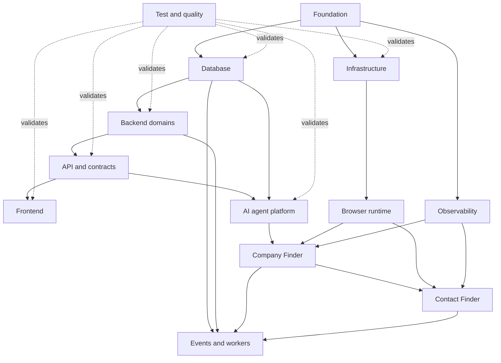

# LOOP Development Plans

This folder is the **single source of truth** for the greenfield LOOP product — vision, architecture, database, API, agents, events, and implementation roadmap. Greenfield code lives in **`loop/`** at the repo root.

## Planning principles

- Build a modular monolith first; extract services only after measured scaling pressure.
- Keep operator and agent writes on the same application-use-case path.
- Deliver a working vertical slice after every implementation stage.
- Preserve locked product decisions: one immutable strategy per sales strategy, company-before-contact registration, human validation/outreach, and Sales-strategy-scoped agent memory.
- Use PostgreSQL from the first migration, Axios for frontend HTTP, Zustand for frontend state, and strict SRP boundaries.
- **Single operator**, multi-org URL navigation (`/orgs/{orgId}/...`), no login/RBAC/permissions.
- Greenfield code in **`loop/`** at repo root; agents share operator Playwright MCP session.
- Company `domain` normalized registrable domain from input URL; contact `linkedin_url` canonical `/in/` profile URL.
- **Blacklist** on junction rows: `SalesStrategyCompany.is_blacklisted` / `SalesStrategyProspect.is_blacklisted` (default `false`), `blacklist_reason` required when `true`; audit log retains history on unblacklist.
- Stop agent processes **immediately**; snapshot viewer **embedded** in operator web (`apps/web` Threads tab).

## Component plans

| Order | Component | Purpose | Depends on |
|------:|-----------|---------|------------|
| — | [Knowledge model](knowledge/README.md) | Four knowledge areas — Organization, Product, Sales Strategy, Prospect | [Knowledge model](knowledge/knowledge-model.md#four-knowledge-areas) |
| — | [Knowledge forms](form/README.md) | Organization, Product/Service, and Sales Strategy form specs — gates, JSON schemas, wizard checklists | [Knowledge model](knowledge/knowledge-model.md), [Database](02-database.md) |
| — | [Agent / AgentWithBrowser](agent/AgentWithBrowser/README.md) | LOOP deep-agent development: platform, browser, factory, checkpoints, Company/Contact Finder, prompts | [AI architecture](agent/AgentWithBrowser/README.md); [Knowledge forms](form/README.md) |
| 1 | [Foundation and monorepo](01-foundation.md) | Establish repository layout, conventions, shared configuration, contracts, and developer workflow | None |
| 2 | [Database and persistence](02-database.md) | Define PostgreSQL schemas, migrations, repositories, transactional boundaries, and backups | Foundation |
| 3 | [Backend domains](03-backend-domains.md) | Implement seller domains, global Company/Prospect registries, strategy selection links, Validation, Outreach, and Analytics | Foundation, Database, [Knowledge forms](form/README.md) |
| 4 | [API and contracts](04-api-and-contracts.md) | Publish stable REST/OpenAPI contracts for operators, agents, and generated frontend types | Backend domains, Database, [Knowledge forms](form/README.md) |
| 5 | [Frontend](05-frontend.md) | Build product forms and the five-tab sales strategy workspace with company drill-down | API and contracts, [Knowledge forms](form/README.md), [UI theme](15-ui-theme-and-design-system.md) |
| 6 | [AI agent platform](agent/AgentWithBrowser/01-platform.md) | Build tools, memory, prompts, deep-agent factory, checkpoints, threads, and whiteboards | API, Database, Observability foundation |
| 7 | [Browser runtime](agent/AgentWithBrowser/02-browser-runtime.md) | Connect to operator-maintained shared Playwright MCP session, snapshot compaction, recovery, and browser guardrails | Foundation, Infrastructure |
| 8 | [Company Finder](agent/AgentWithBrowser/05-company-finder.md) | Automate company discovery and registration with sales strategy quotas | AI platform, Browser runtime, Company APIs, [Company Finder prompt](agent/AgentWithBrowser/prompts/company-finder/README.md) |
| 9 | [Contact Finder](agent/AgentWithBrowser/06-contact-finder.md) | Automate contact discovery one validated company at a time | Company Finder patterns, Contact APIs, Browser runtime, [Contact Finder prompt](agent/AgentWithBrowser/prompts/contact-finder/README.md) |
| 10 | [Events and background workers](10-events-and-workers.md) | Run outbox delivery, queues, scheduler, process control, retries, and DLQs | Database, Backend, Agent runtimes |
| 11 | [Observability and operations](11-observability.md) | Add traces, metrics, logs, audit history, cost attribution, and operational dashboards | Foundation; integrated into every component |
| 12 | [Testing and quality](13-testing-quality.md) | Define unit, integration, contract, E2E, agent evaluation, load, and recovery testing | Cross-cutting; begins with Foundation |
| 13 | [Infrastructure and deployment](14-infrastructure-deployment.md) | Containerize, provision, deploy, back up, promote, and operate all runtime applications | Foundation; evolves with every runtime |
| — | [UI theme and design system](15-ui-theme-and-design-system.md) | Dark-first LOOP operator theme, tokens, layout, and shared components (Radix + Tailwind) | Foundation web shell; consumed by Frontend |

Agent deep-dive docs (factory, checkpoints, architecture extracts): [agent/AgentWithBrowser/](agent/AgentWithBrowser/README.md).

## UI theme (approved)

Production operator UI uses the **dark-first LOOP theme** documented in [15-ui-theme-and-design-system.md](15-ui-theme-and-design-system.md):

- Near-black surfaces (`#121212`), amber primary accent (`#FFB800`), coral destructive actions, blue-violet info metrics
- Global nav + horizontal tabs (active tab = amber pill)
- Summary **MetricTile** cards + searchable **DataTable** rows (Records Viewer, Threads, logs)
- Optional **SideRail** (~30%) for editable process whiteboard (agent + operator)
- Reference screenshot: [assets/loop-ui-theme-reference.png](assets/loop-ui-theme-reference.png)

Implement tokens and shell in Stage 0/1 before feature screens.

## Dependency relationships

## Recommended implementation order

### Stage 0 — Decisions and delivery skeleton

Implement Foundation, the minimum Infrastructure dev environment, and the Testing harness. Produce ADRs for unresolved choices, CI checks, health endpoints, local PostgreSQL/Redis, OpenTelemetry bootstrap, and empty API/web shells.

**Exit gate:** a clean checkout can be built, tested, and deployed to development.

### Stage 1 — Manual product vertical slice

Implement Database, Backend domains, API contracts, and frontend flows for:

1. Organization with **[Organization Form](form/organization_form.md)** profile (business fit).
2. Product/Service profile — **[service_form.md](form/service_form.md)** (18 sections).
3. Sales Strategy creation with immutable **[Sales Strategy form](form/sales_strategy_form.md)** (v2.0).
4. Manual company registration, mark-valid, company/prospect blacklist, and Records Viewer.
5. Manual contact registration and Company detail outreach.

**Exit gate:** an operator can create a strategy, link a global company, register/link a global prospect, and record outreach without an AI agent.

### Stage 2 — Durable asynchronous platform

Implement transactional outbox, integration events, workers, scheduler, process-state endpoints, progress projections, retry/DLQ behavior, and full observability.

**Exit gate:** business events survive restarts, projections reconcile with OLTP, and failed jobs can be diagnosed/replayed.

### Stage 3 — Shared agent foundation

Implement [AgentWithBrowser](agent/AgentWithBrowser/README.md) platform pieces: agent tools, Sales-strategy-scoped Brain memory, scratchpad/whiteboard storage, [`create_loop_deep_agent`](agent/AgentWithBrowser/04-deep-agent-factory.md), [nested checkpointing](agent/AgentWithBrowser/03-checkpoints-and-threads.md), `AgentRun`, effort/thread allocation, Threads API, and snapshot viewer ([01-platform](agent/AgentWithBrowser/01-platform.md)).

**Exit gate:** a synthetic agent effort can call read-only tools, checkpoint/resume nested children, appear in Threads, and render its whiteboard.

### Stage 4 — Browser and Company Finder

Complete [browser runtime](agent/AgentWithBrowser/02-browser-runtime.md) MCP client and recovery, then [Company Finder](agent/AgentWithBrowser/05-company-finder.md) start/stop, one-candidate efforts, quota enforcement, registration authority, thread linking, logs, and process UI.

**Exit gate:** Company Finder reliably fills a sales strategy to `target_companies`, stops, and leaves failed efforts unlinked but inspectable.

### Stage 5 — Contact Finder and complete sales strategy workspace

Implement [Contact Finder](agent/AgentWithBrowser/06-contact-finder.md) validated-company queueing, one-company-at-a-time contact efforts, frozen `sales_strategy_attempt_at_register`, fixed per-company contact quota, process whiteboard, and parallel operation with Company Finder.

**Exit gate:** Contact Finder fills each open company quota without registering against invalid companies or exceeding N.

### Stage 6 — Production hardening

Add privacy/retention controls, load testing, backup restore drills, security review, autoscaling, runbooks, and gradual rollout flags. Optional: Verifier agent and automated LinkedIn outreach when product priorities allow.

## Parallel work streams

| Stream | Can begin | Work |
|--------|-----------|------|
| Product/API | Stage 0 | Domains, migrations, use cases, OpenAPI |
| Frontend | After API schemas stabilize | Theme tokens + shell first, then forms, sales strategy workspace, records/detail, process and thread tabs |
| Agent platform | After sales strategy bundle and registration contracts stabilize | [AgentWithBrowser](agent/AgentWithBrowser/README.md) tools, factory, memory, checkpoints |
| Browser runtime | Stage 0 | [Browser runtime](agent/AgentWithBrowser/02-browser-runtime.md) isolation, MCP gateway, compaction, session recovery |
| Operations | Stage 0 | CI/CD, telemetry, local services, alerts, backups |
| Quality | Stage 0 | Test fixtures, contract gates, E2E harness, eval datasets |

## Release gates

Every stage must satisfy:

- Automated tests and contract checks pass.
- New migrations are backward-compatible and tested on production-like PostgreSQL.
- New external calls emit trace spans and structured errors.
- Domain transitions and registrations are audited.
- API changes regenerate shared TypeScript types.
- Operational changes include dashboards, alerts, and runbook updates.
- No secrets, browser cookies, or raw sensitive snapshots enter logs or source control.

## Optional later capabilities

- Company Detail Enricher agent; reserves optional `CompanyProfile` and Contact Finder works without it.
- Autonomous Verifier agent.
- Automated LinkedIn connection requests or messaging.
- GraphQL.
- Temporal workflow migration.
- OpenSearch, multi-region, database sharding, and service extraction.
- Multi-tenant external SaaS capabilities.

## Four knowledge areas

| # | Area | Form / storage |
|---|------|----------------|
| 1 | Organization — who we are | [organization_form.md](form/organization_form.md) → `OrganizationProfile.org_form` |
| 2 | Product/Service — what we sell | [service_form.md](form/service_form.md) → `ProductProfile.icp_form` |
| 3 | Sales Strategy — who to target now | [sales_strategy_form.md](form/sales_strategy_form.md) → `SalesStrategy.sales_strategy_form` |
| 4 | Prospect — global identities + strategy links | [knowledge-model.md](knowledge/knowledge-model.md) |

## Source-of-truth hierarchy

1. Master roadmap and planning principles: this `plans/README.md`
2. Knowledge model: [`plans/knowledge/knowledge-model.md`](knowledge/knowledge-model.md)
3. Knowledge form contracts: [`plans/form/`](form/README.md)
4. AgentWithBrowser implementation: [`plans/agent/AgentWithBrowser/`](agent/AgentWithBrowser/README.md)
5. Database, API, backend, frontend, events, and ops: numbered component plans in this folder

When documents conflict, update the owning component plan and record a new ADR when the conflict is architectural.
