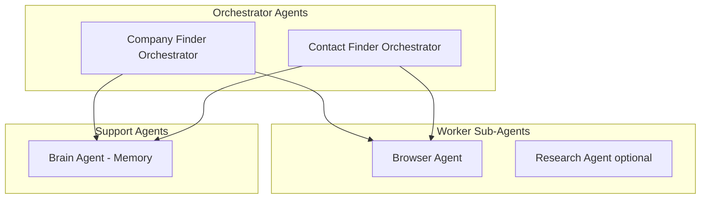

# AgentWithBrowser Architecture Overview

> Canonical source for the AI architecture (topology, tools, prompts, memory, workflows, guardrails).

Shared topology, tools, prompts, memory, workflows, and guardrails for LOOP deep agents that use a Browser sub-agent.

Detailed implementation plans:

- [01-platform.md](01-platform.md) — shared platform
- [02-browser-runtime.md](02-browser-runtime.md) — Playwright MCP pool
- [03-checkpoints-and-threads.md](03-checkpoints-and-threads.md) — §9.12
- [04-deep-agent-factory.md](04-deep-agent-factory.md) — §9.13
- [05-company-finder.md](05-company-finder.md) / [06-contact-finder.md](06-contact-finder.md) — process agents
- [prompts/](prompts/README.md) — discovery prompt templates

## 9. AI Architecture

### 9.1 Agent topology (production)



> Contact validation and outreach are **human operator actions** only.

### 9.2 Agent responsibilities

| Agent | Goal | Registers |
|-------|------|-----------|
| **Company Finder** | Find target companies matching the sales strategy form | global `Company` + `SalesStrategyCompany` via `register_company` only |
| **Contact Finder** | Find people inside **validated** companies until per-company `contacts_target` met | `ProspectProfile` + `CompanyProspect` + `SalesStrategyProspect` via `register_contact` only |
| **Browser** | Execute web tasks only; **no** `register_*` tools | — |
| **Brain** | Recall/persist long-term memory (Sales-strategy-scoped) | memory entries |

### 9.3 Removed legacy concepts

| Removed | Production LOOP |
|---------|-----------------|
| Persona-based `audience` field | [Sales Strategy form](../../form/sales_strategy_form.md) — one playbook per sales strategy |
| Three hypothesis slots per sales strategy | One immutable strategy per sales strategy; new run = new sales strategy |
| Source split (search/content) with caps | `target_companies` on sales strategy; source-agnostic discovery |
| Global singleton organization profile | Per-organization [organization_form.md](../../form/organization_form.md) + per-product [service_form.md](../../form/service_form.md) |
| Single combined prospect finder | Company Finder → Contact Finder pipeline |
| Ad-hoc thread id patterns | `LOOP_{org}_{product}_{sales_strategy}_{attempt}_*` — see [§9.12](03-checkpoints-and-threads.md#912-agent-effort-threads-and-snapshot-viewer) |

### 9.4 Tool system design

- Tools invoke **application use cases** (same as REST)
- JSON Schema tool definitions generated from OpenAPI operations
- **Idempotent** by natural keys
- Tool results include `evidence_refs` (URLs visited, snapshot IDs in object storage)

### 9.5 Prompt management

```text
packages/ai/prompts/
├── company_finder/
│   ├── system/v1.md
│   ├── responsibility/v1.md
│   └── heartbeat/v1.jinja
├── contact_finder/
├── browser/
└── brain/
```

- Prompts versioned (`v1`, `v2`); runtime selects via feature flag
- Jinja for dynamic heartbeat/scratchpad injection
- PR review required for prompt changes (treated as code)

### 9.6 Context management

| Layer | Max budget | Content |
|-------|------------|---------|
| System prompt | Fixed | Role + responsibility |
| Scratchpad | ~500 tokens | Last outcome, quotas, next action |
| Sales Strategy bundle | ~2K tokens | `sales_strategy_form` excerpt + compressed product `icp_form` |
| Brain recall | ~4K tokens | Top-K memory search results |
| Browser evidence | Variable | Compacted snapshots |
| Conversation | Remainder | Summarize at 70% context |

### 9.7 Memory architecture

| Tier | Store | TTL | Content |
|------|-------|-----|---------|
| Scratchpad | Redis/Postgres KV | Overwritten each heartbeat | Orientation |
| Checkpoints | Postgres | 90 days (configurable) | Full graph state |
| Long-term memory | pgvector / dedicated vector DB | Indefinite with archival | actions, failures, decisions, insights |
| Evidence artifacts | S3 | 30 days | Browser snapshots |

Namespaces: `{AgentType}/{category}` e.g. `CompanyFinder/decisions`.

### 9.8 RAG usage

- **Brain recall:** semantic search over memory entries (not full document RAG)
- **Product `icp_form` + sales strategy `sales_strategy_form`:** structured JSON injection, not vector RAG 
- **Future:** RAG over sales_strategy retrospectives for 

### 9.9 Token and cost optimization

- Snapshot compaction middleware
- Summarization at 70% context window
- Cheaper models for Browser tool selection; stronger models for registration decisions
- Cache `get_sales_strategy_bundle` per heartbeat (invalidate on config change event)

### 9.10 Multi-agent workflows

**One attempt = one company or one contact try.** Thread is linked to an entity **only** on successful `register_company` / `register_contact`. All efforts appear on the sales strategy **Threads** tab (linked + unlinked).

Company Finder effort (production):

1. **Start effort** — allocate unique `effort_seq` (monotonic per sales strategy); prefix `LOOP_{org_id}_{product_id}_{sales_strategy_id}_{effort_seq}`; create sub-agent threads; **no `company_id` yet**
2. Orient — load sales strategy bundle, Brain recall (Sales-strategy-scoped)
3. Quota check — `companies_registered >= target_companies` → stop; `register_company` returns **409** if target met
4. Delegate Browser — research one company candidate (any source)
5. `register_company` — upsert global Company, create SalesStrategyCompany, increment strategy counter, freeze its attempt value, link thread; emit global `CompanyRegistered` only when new and `SalesStrategyCompanySelected` for the new link
6. On failure (no registration) — effort stays **unlinked**; `company_finder_attempt` unchanged
7. Close — scratchpad + Brain persist; next loop iteration starts a **new** effort with new `effort_seq`

Contact Finder effort (production — **separate background process**, started from **Contact Finder Process** tab; **one company at a time**):

1. **Start effort** — pick validated company with `contacts_registered < contacts_target`; allocate `contact_effort_seq` for that company; prefix `LOOP_{org_id}_{product_id}_{sales_strategy_id}_{sales_strategy_attempt_at_register}_{company_id}_{contact_effort_seq}` (`sales_strategy_attempt_at_register` **frozen** on company at first successful `register_company`)
2. Orient — load sales strategy bundle + company row (`contacts_target`, `contacts_registered`, role signals)
3. Quota check — skip if `contacts_registered >= contacts_target` or `contacts_per_company_default <= 0`
4. Delegate Browser — find next contact candidate at `company_id` (exclude already-registered profiles)
5. **Either** `register_contact(full_profile, selection/fit/evidence)` — runtime binds active strategy + company; full register with `is_blacklisted = false`; link thread **or** `blacklist_prospect(linkedin_url, reason)` — minimal input; sparse register-if-missing + `is_blacklisted = true`; does not count toward N
6. If `contacts_registered >= contacts_target` after a successful register → `contacts_batch_done`; else `finding_contacts`
7. Close — scratchpad + Brain persist; pick next queued company on next effort

**Contact Finder queue rule:** only companies in `company_validated`, `finding_contacts`, or `contacts_batch_done` with `contacts_registered < contacts_target`, `SalesStrategyCompany.is_blacklisted = false`, and open prospect quota.
### 9.11 Evaluation and guardrails

| Guardrail | Enforcement |
|-----------|-------------|
| No invented URLs | Tool rejects URLs not in `evidence_refs` |
| Quota caps | API returns 409; agent must stop |
| Rate limits | LinkedIn actions throttled in browser pool |
| PII | Redact before logging |
| Prompt injection | Browser content treated as untrusted data |

**Eval pipeline (CI):**

- Golden tests for URL normalization, quota logic
- Offline eval sets for registration decisions (human-labeled companies)
- Regression on token usage per heartbeat
