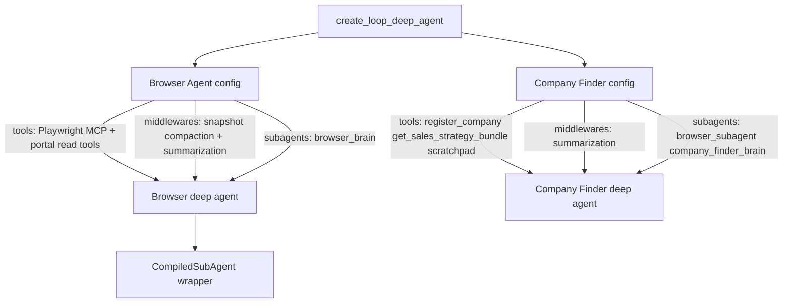

# LOOP Deep-Agent Factory

> Canonical source for `create_loop_deep_agent`, stack builders, and registration authority.

This plan owns `create_loop_deep_agent`, stack builders, registration authority, and the Browser-as-subagent composition pattern.

### 9.13 LOOP deep-agent factory

Replaces duplicated `create_deep_agent` call sites with one reusable factory. Every LOOP deep agent shares the **self-improving prompt pattern** (agent **name** + **responsibility** document); each call site passes only what that role needs.

#### Design principles

| Rule | Detail |
|------|--------|
| One factory | `create_loop_deep_agent(...)` builds Company Finder, Contact Finder, Browser, and future roles |
| No config leakage | Browser receives **only** `tools` and `middlewares` passed to **its** factory call — not orchestrator tools |
| Composable `subagents` | Orchestrator passes `[browser_subagent, brain_subagent, …]` — extensible list |
| Nested checkpointed subagents | Every custom `CompiledSubAgent` gets a child thread persisted in the parent checkpoint before invocation |
| Custom compiled GPA | Inner GPA uses nested checkpointing plus `_GPA_n` allocation; resume reuses the active `_GPA_n` instead of allocating the next number |
| Shared effort context | `store`, `checkpointer`, `effort_prefix`, `loop_context` passed into every factory call |

#### Factory signature

```python
@dataclass
class LoopDeepAgentConfig:
    name: str                          # e.g. "Company Finder", "Browser Agent"
    responsibility: str                # responsibility markdown or registry key
    tools: list                        # role-specific only
    middlewares: list                  # role-specific only
    store: BaseStore
    checkpointer: BaseCheckpointSaver
    effort_prefix: str                 # LOOP_<org>_<product>_<sales_strategy>_<attempt>[...]
    role_suffix: str                   # company_finder | browser_agent | contact_finder | ...
    subagents: list[CompiledSubAgent]  # default []
    loop_context: LoopAgentToolContext
    model: BaseChatModel
    backend: FilesystemBackend
    permissions: list[FilesystemPermission]

def create_loop_deep_agent(config: LoopDeepAgentConfig) -> CompiledStateGraph:
    """Build deep agent with self-improving system prompt from name + responsibility."""

def build_role_thread_id(effort_prefix: str, role_suffix: str) -> str:
    return f"{effort_prefix}_{role_suffix}"
```

**System prompt assembly** (from POC `Dev/Prompts/` self-improving pattern):

```jinja
You are {{ name }}.
{{ responsibility_body }}
```

#### Company Finder stack (build order)



```python
def build_company_finder_stack(*, effort_prefix: str, loop_context: LoopAgentToolContext, ...) -> CompanyFinderStack:
    browser = create_loop_deep_agent(LoopDeepAgentConfig(
        name="Browser Agent",
        responsibility=load_prompt("browser/responsibility/v1.md"),
        tools=browser_tools,           # Playwright MCP only + portal presence tools
        middlewares=browser_middlewares,
        effort_prefix=effort_prefix,
        role_suffix="browser_agent",
        subagents=[browser_brain_subagent],
        ...
    ))
    browser_subagent = to_compiled_subagent(browser, ...)

    company_finder = create_loop_deep_agent(LoopDeepAgentConfig(
        name="Company Finder",
        responsibility=load_prompt("company_finder/responsibility/v1.md"),
        tools=company_tools,
        middlewares=company_middlewares,
        effort_prefix=effort_prefix,
        role_suffix="company_finder",
        subagents=[browser_subagent, company_finder_brain_subagent],
        ...
    ))
    return CompanyFinderStack(company_finder=company_finder, browser=browser, ...)
```

Contact Finder uses the same pattern with `role_suffix="contact_finder"`, a **new** browser subagent instance (contact effort prefix), and contact-specific tools/responsibility.

#### Registration authority & browser tool matrix

| Tool / action | Company Finder orchestrator | Contact Finder orchestrator | Browser subagent |
|---------------|----------------------------|----------------------------|------------------|
| `register_company` | Yes | No | **No** |
| `register_contact` | No | Yes | **No** |
| `get_sales_strategy_bundle` | Yes | Yes | Read-only (if passed) |
| `get_company` | Optional | Yes | Read-only (if passed) |
| `is_profile_present` | Optional | Yes | Yes |
| `blacklist_company` | Optional | No | No |
| `blacklist_prospect` | No | Yes | No |
| Playwright / navigate | No | No | Yes |
| `set_scratch_pad` | Yes | Yes | No |

Browser tools are **situation-specific** (company research vs contact profile lookup) but never include registration tools.

**Contact Finder tool payloads:**

| Tool | Agent sends | Runtime supplies |
|------|-------------|------------------|
| `register_contact` | Full profile + selection/fit/evidence | `sales_strategy_id`, `company_id` from active effort |
| `blacklist_prospect` | `linkedin_url`, `blacklist_reason`; optional sparse name/title | `sales_strategy_id`, `company_id` from active effort |

#### Thread IDs per factory call

| Agent | `role_suffix` | `thread_id` (orchestrator) |
|-------|---------------|----------------------------|
| Company Finder | `company_finder` | `{effort_prefix}_company_finder` → linked on `register_company` |
| Browser Agent | `browser_agent` | `{effort_prefix}_browser_agent` |
| Contact Finder | `contact_finder` | `{effort_prefix}_contact_finder` → linked on `register_contact` |
| Brain (per role) | `company_finder_brain`, `browser_agent_brain`, … | `{effort_prefix}_{role}_brain` |

**GPA invocations** inside any deep agent use `allocate_gpa_thread_id(parent_role_thread)` — see [§9.12 GPA allocation](03-checkpoints-and-threads.md#gpa-thread-allocation-db-max--1).

#### Factory mapping

| Legacy pattern | Production factory |
|----------------|-------------------|
| Duplicate `create_deep_agent` blocks | `build_company_finder_stack()` / `build_contact_finder_stack()` |
| Separate prompt strings per agent | `name` + `responsibility` per `LoopDeepAgentConfig` |
| Inline browser agent builder | Browser = first factory call → `CompiledSubAgent` in orchestrator `subagents` |
| Ad-hoc thread id builders | `effort_prefix` = `LOOP_{org}_{product}_{sales_strategy}_{attempt}` — [§9.12](03-checkpoints-and-threads.md) |

#### Package layout

```text
packages/ai/
├── loop_agent_factory.py      # create_loop_deep_agent, allocate_gpa_thread_id, build_*_stack
├── prompts/
│   ├── self_improving_base.jinja
│   ├── company_finder/responsibility/v1.md
│   ├── contact_finder/responsibility/v1.md
│   └── browser/responsibility/v1.md
└── ...
```

---
