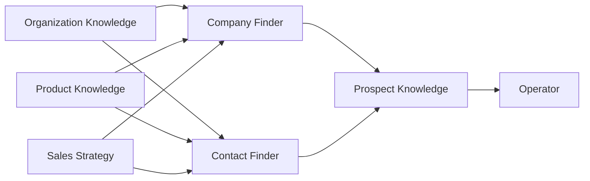

# LOOP Knowledge Model

> **Architecture reference:** How seller context, strategy, and prospect data are separated in production LOOP.  
> See [Four knowledge areas](knowledge-model.md#four-knowledge-areas) and form specs below.

Keeping these areas separate makes it easier for salespeople and AI agents to judge **business fit**, **product fit**, **strategy fit**, and **prospect-specific evidence** independently.

---

## Four knowledge areas

```text
┌─────────────────────────────────────────────────────────────────┐
│ 1. Organization Knowledge          Who we are                   │
│    form/organization_form.md → OrganizationProfile.org_form      │
├─────────────────────────────────────────────────────────────────┤
│ 2. Product/Service Knowledge       What we sell                 │
│    form/service_form.md → ProductProfile.icp_form                │
├─────────────────────────────────────────────────────────────────┤
│ 3. Sales Strategy Knowledge        Who to target NOW & how      │
│    form/sales_strategy_form.md → SalesStrategy.sales_strategy_form │
├─────────────────────────────────────────────────────────────────┤
│ 4. Prospect Knowledge              Global companies + people    │
│    Company/Profile + ProspectProfile + strategy link tables     │
└─────────────────────────────────────────────────────────────────┘
```

| # | Knowledge area | Question | Storage | Stability |
|---|----------------|----------|---------|-----------|
| 1 | **Organization** | Who are we? | `OrganizationProfile.org_form` | Stable; update when seller company changes |
| 2 | **Product/Service** | What do we sell? | `ProductProfile.icp_form` | Stable per offering; update when product evolves |
| 3 | **Sales Strategy** | Who should we target **right now**, how do we approach them, what are we testing? | `SalesStrategy.sales_strategy_form` | **Versioned per sales strategy** — each sales strategy is one playbook snapshot |
| 4 | **Prospect** | What do we know about **this** company/person, and why is it in this strategy? | Global `Company`, `CompanyProfile`, `ProspectProfile`, `CompanyProspect`; strategy links `SalesStrategyCompany`, `SalesStrategyProspect` | Global identity is reusable; strategy links grow through discovery and outreach |

---

## 1. Organization Knowledge — *Who we are*

**Form:** [../form/organization_form.md](../form/organization_form.md)

| Pillar | Contents |
|--------|----------|
| **Mission** | Company overview, mission, what the seller does |
| **Industry** | Industries the **seller organization** operates in |
| **Strengths** | Unique strengths, brand positioning, competitive advantages |
| **Capabilities** | Delivery capability, technology expertise, certifications, partnerships |
| **Markets** | Target markets, geographies, customer segments |
| **Customers** | Existing customer types, references, case studies |
| **Strategy** | Sales goals, pricing position, sales process, deal constraints |

**Used for:** Business fit — can we legally, operationally, and commercially serve this prospect?

---

## 2. Product/Service Knowledge — *What we sell*

**Form:** [../form/service_form.md](../form/service_form.md)

| Pillar | Contents |
|--------|----------|
| **Features** | What the offering includes (scope, modules, integrations) |
| **Benefits** | Value proposition, outcomes, differentiators |
| **Pain points solved** | Problems the product/service addresses |
| **ICP** | General ideal customer profile for this offering |
| **Pricing** | Model, range, minimum deal size, engagement model |
| **Competitors** | Who prospects use instead; why customers switch |
| **Buying triggers** | Events that indicate need for **this product** |

**Used for:** Product fit — does this prospect need **what we sell**?

---

## 3. Sales Strategy Knowledge — *Who to target now & how*

**Form:** [../form/sales_strategy_form.md](../form/sales_strategy_form.md) — see also [form plan README](../form/README.md).

Captured when creating a **sales_strategy**. Unlike layers 1–2, strategy is **experiential and time-bound** — e.g. “logistics companies this quarter,” “target CTOs first,” “mention SOC 2 in first touch.”

| Category | Purpose |
|----------|---------|
| Target Company Profile | What kinds of companies to approach **in this run** |
| Target Decision Makers | Roles to contact first |
| Priority Industries / Geographies | Focus list for this sales strategy |
| Company Size | Employee and revenue ranges for this run |
| Buying Signals | Events indicating readiness **now** |
| Prospecting Strategy | How to find companies (LinkedIn, Crunchbase, …) |
| Outreach Strategy | Channels and approach (LinkedIn-first) |
| Messaging Hypotheses | Value props and angles to test |
| Qualification / Blacklist | Worth pursuing vs skip |
| Prioritization Rules | Who to contact first |
| Competitor Targeting | Good targets based on incumbent vendor |
| Exclusion Rules | Companies, industries, regions to avoid |
| Experiments | New ICPs, industries, messaging, or channels being tested |
| Success Metrics | Meetings, reply rate, pipeline (operator-defined) |
| Lessons Learned / Best Practices | What worked or failed (copied from prior sales strategies or filled at create) |

**Used for:** Strategy fit — is this prospect right **for this sales strategy’s current playbook**?

### How “dynamic” strategy works in LOOP

Each **sales strategy = one playbook snapshot** (`sales_strategy_form` immutable after create — see FR-2). Continuous learning is modeled as:

1. **New sales strategy** — test a new hypothesis, industry focus, or messaging angle (recommended).
2. **Create wizard pre-fill** — copy `lessons_learned`, `best_practices`, and targeting from a previous sales_strategy or template.
3. **Prospect Knowledge** — blacklist/mark valid and outreach outcomes inform the **next** sales_strategy design.
4. **Agent Brain** — Sales-strategy-scoped memory compacts operational learnings during a run (does not mutate frozen `sales_strategy_form`).

Examples that belong in **Sales Strategy** (sales strategy form), not org/product forms:

* “Healthcare companies under 100 employees aren’t converting.”
* “Mention SOC 2 in the first message — increases replies.”
* “Companies hiring AI engineers respond well this quarter.”
* “Avoid Competitor X unless they’re scaling fast.”

---

## 4. Prospect Knowledge — *Global identity + strategy selection*

Prospect Knowledge is **not a fill-once form**. LOOP separates reusable global facts from the reason a company or person appears in a specific sales strategy.

### Global company registry

| Entity | Captures | Creation |
|--------|----------|----------|
| **`Company`** | `name`, globally unique `domain` (registrable domain normalized from input URL) | `register_company` get-or-create |
| **`CompanyProfile`** | LinkedIn company URL, industry, sub-industry, headquarters, operating countries, employee count, revenue range, founded year, ownership, business model, description | Optional future Company Detail Enricher; Contact Finder does **not** require it |

`Company` is independent of Organization, Product, and Sales Strategy. The same global company can be linked to many sales strategies.

### Strategy-to-company selection

**`SalesStrategyCompany`** links `sales_strategy_id + company_id` and stores why the company belongs in this run:

- `selection_reason`
- mark-valid, queue state, `contacts_target`, `contacts_registered`, `is_blacklisted`, `blacklist_reason`
- discovery thread and frozen `sales_strategy_attempt_at_register`

Company/prospect **blacklist** is stored on junction rows: `is_blacklisted` (default `false`), `blacklist_reason` (required when `true`), optional `blacklisted_at` / `blacklisted_by`.

`register_company(name, website_url, selection_reason)` normalizes URL to `domain`, get-or-creates global `Company`, then creates `SalesStrategyCompany`. It does **not** populate `CompanyProfile`.

### Global prospect registry

| Entity | Captures |
|--------|----------|
| **`ProspectProfile`** | Full name, job title, department, seniority, globally unique LinkedIn URL, public email, public phone, location |
| **`CompanyProspect`** | One active association: prospect works at company (`company_id + prospect_profile_id`; replace on employer change) |

`register_contact` uses the **full profile** payload; runtime links to the **active sales strategy + company**. `blacklist_prospect` uses **minimal** input and may sparse-register then blacklist when not yet linked.

### Strategy-to-prospect selection

**`SalesStrategyProspect`** links `sales_strategy_id + company_id + prospect_profile_id`, proving that this prospect was selected inside this company for this strategy. It stores strategy-specific selection reason, fit/confidence/evidence, funnel state, discovery audit, and outreach outcomes.

**Used for:** Reusing global company/person identities while independently tracking why they were selected and what happened in each sales strategy.

---

## How agents combine the four layers



**`register_company.selection_reason`** must briefly address:

1. Organization business fit (deal constraints, markets, delivery)
2. Product fit (pain, ICP, triggers)
3. Sales strategy fit (signals, qualification, exclusions)
4. Observed evidence supporting selection

Detailed company firmographics are deliberately not part of `register_company`; they belong to optional future `CompanyProfile` enrichment.

---

## Form index

| Knowledge area | Document | JSON field |
|----------------|----------|------------|
| Organization | [../form/organization_form.md](../form/organization_form.md) | `OrganizationProfile.org_form` |
| Product/Service | [../form/service_form.md](../form/service_form.md) | `ProductProfile.icp_form` |
| Sales Strategy | [../form/sales_strategy_form.md](../form/sales_strategy_form.md) | `SalesStrategy.sales_strategy_form` |
| Prospect | [knowledge-model.md](knowledge-model.md) §4 | `Company`, `CompanyProfile`, `ProspectProfile`, `CompanyProspect`, `SalesStrategyCompany`, `SalesStrategyProspect` |

---

## Gates

```text
Organization profile complete  →  create Product/Service
Product profile complete       →  create Sales Strategy
Sales Strategy created         →  Company Finder / Contact Finder
Discovery                      →  global registry + strategy selection links
```
